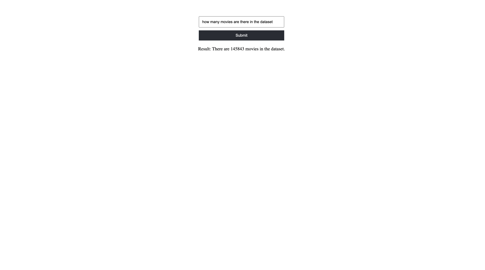

# DataAnalyzer
Data analysis using foundational models

## Frontend

## Tech Stack
* Foundational Model - Google Gemini
* Frontend - React
* APIs - GraphQL, Springboot
* Programming languages - Python, JavaScript, Java
* Database - MongoDB Atlas

## Dataset
[Netflix Dataset](https://www.kaggle.com/datasets/shivamb/netflix-shows)
